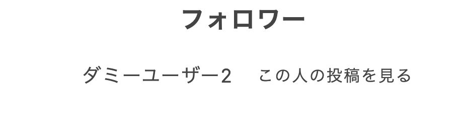

# recipes-front

簡単なレシピアプリを作ってみました。フロントエンドはNextjs、バックエンドはRuby on RailsのAPIモードで開発しました。

# 主な機能
- レシピの閲覧(ユーザー登録しなくても可)
- レシピ投稿(ユーザー登録必須)、レシピ削除(投稿した本人だけが削除可能で、第三者からレシピを削除はできません)機能
- お気に入り登録機能(ユーザー登録必須)
- フォロー機能(ユーザー登録必須)

# 主な使い方
以下が簡単な使い方です。

## 1. トップページでレシピ一覧を見る。一覧画面ではレシピの名前、そのレシピを投稿したユーザー名が表示されます。

## 2. 気になったレシピがあったら、そのレシピの箇所をクリックすると、詳しい作り方が書いてある詳細ページへ飛びます。(ちなみに、投稿した本人である場合はその投稿を削除できます)

## 3. 以下はユーザー登録、ログインをすることで、使える機能を紹介します。もちろん、ユーザー登録をしなくても、レシピを見ることはできます。

## 以下のようなユーザー登録画面です

## 4. レシピを投稿する

## 実際のレシピ投稿画面です

## 5. 興味のあるレシピをトップページで「保存」ボタンを押すことでお気に入り登録できます。正常に保存されれば、「お気に入りを解除」と表示されます。

## 「保存」ボタンを押した後、トップページの「保存済みレシピを見る」を押すと、保存したレシピの一覧が見れる。

## 6. フォロー機能も使える。5.と同様にトップページでフォローしたいユーザーがいれば「フォローする」ボタンを押す。そのリクエストがうまくいけば、「フォローを解除」と表示される。

## 「フォローする」ボタンを押した後、トップページの「フォローしている人を見る」を押すと、フォローした人を見られる。

## 7. フォロワーを見ることもできます。現時点でログインしている「ダミーユーザー」を他のアカウントでフォローしてみます。

## ここでは「ダミーユーザー2」としてユーザー登録をしています

## 次に、トップページに飛ぶので、先ほどまでログインした「ダミーユーザー」として投稿したレシピのユーザーを「フォローする」ボタンを押してフォローしてみましょう。

## その後、再び「ダミーユーザー」としてログインして、トップページで「フォロワーを見る」というリンクを押すと、先ほど「ダミーユーザー」をフォロした「ダミーユーザー2」、つまり「ダミーユーザー」のフォロワーの名前が表示されます。

# 工夫した点
## 1. SSRとSuspenseを併用して、真っ白な画面の状態でユーザーを待たせないようしました。UXの工場が期待できます。

## 2. 画像を表示するのに通常のHTMLのimgタグではなく、NextjsのImageコンポーネントを使用ました。Imageコンポーネントを使うことで画像の最適化が行われるので、Webページの表示速度が上がることにつながります。さらに、自動で遅延読み込みしてくれるそうです。

# 余談
画像を表示する際、NextjsのImageコンポーネントを使って、画像最適化していると説明しましたが、実際どの程度ファイルサイズが変化してみるか確認してみると、通常のHTMLのimgタグを使うのとではかなり違っており、具体的には1.9MBだったものが9.2KBへとなっていたので、驚きました。積極的に使っていきたいと思います。

## 通常のHTMLのimgタグの場合

##　NextjsのImageコンポーネントの場合

